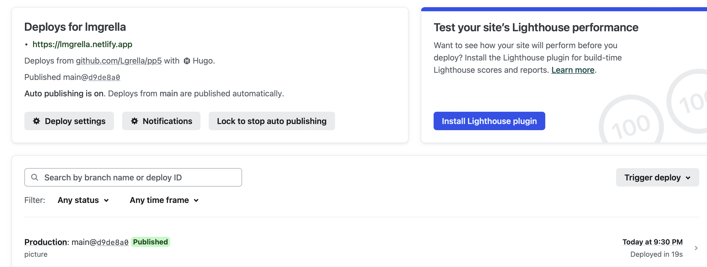

# Individual Project 1: Create and Deploy a Static Website

[](https://app.netlify.com/sites/lmgrella/deploys)

## All about Making the Website

First, to build the website I used Zola with the Adidoks theme.

To build the website, I followed the following steps: 

* Initiate the Zola site and initiate the folder as a git repository. To do that, I ran the following code chunk in my terminal inside my project directory. Make sure you have both git and zola installed.

```
git init
zola init
```
* Now that that is done, we have a shell of a website. Before continuing, I download the Zola theme of interest and incorporate it. To do that, I run the following code chunk. It does the following: copies over the theme as a submodule, creates a config.toml file in the main directory based off of the adidoks suggestion, and copies over the content files to the main directory. Ultimately, these will be what are eventually updated with my content.  

```
git submodule add https://github.com/aaranxu/adidoks.git themes/adidoks
cp themes/adidoks/config.toml.example config.toml
cp -r themes/adidoks/content .
```
* Now that the base of the site is set up, it is time to personalize the site. Ultimately, I used the themed documents as a baseline and replaced information with what I want on my personal portfolio. I updated files in the following folders:
    * authors: I updated this files to include information about me
    * blog: I added my own portfolio information, including a sample blog post.
    * docs: This is my CV section. Here I created three subsections that mirror my resume. 

* While updating the files and site in general, you are able to confirm it is working as expected by running zola serve.  

Here are screenshots of the working website and the various screens.


## All about Deploying the Website.
Now that the website is up and running locally, it needs to be deployed so we are able to access it via a URL. To do the deployment, I chose to use Netlify. Netlify prouds themselves on the fact that their application performs streamlined orchestration, simplified and unified workflows, and real-time updates across infrastructure, workflows, websites and teams.

The deployment is relatively simple, thanks to Netlify. The first two steps set up the deployment: 

* Confirm git repository is up to date and all local changes to the website are pushed to your repository.
* Make an account with Netlify

Next, we need to actually prep for deployment. Most importantly, a netlify.toml file is needed in the root directory. This sets up the automatic deployment on a push to the main branch. The document will include the following code. 

```
[build]
# This assumes that the Zola site is in a docs folder. If it isn't, you don't need
# to have a `base` variable but you do need the `publish` and `command` variables.
base    = "docs"
publish = "docs/public"
command = "zola build"

[build.environment]
ZOLA_VERSION = "0.18.0"

[context.deploy-preview]
command = "zola build --base-url $DEPLOY_PRIME_URL"
```

Moving to the Netlify application interface, I performed the following steps: 

* Select 'Add new Site' and deploy with Github (or wherever your code lives)


* Next, we want to select the repository where our code is. 


* We name our site (this will be the URL name, so make it good!) and we set up the build and deploy criteria. Since we have the toml file, we want to make sure these are cleared out. 


Finally, we click deploy. We can confirm the site deployed, as there will be a green check mark, and we can see the sample homescreen. Additionally, I have included a deployment badge at the top of this readme.

Here are some screenshots of the successful deployment. 



## All about CI/CD

Ultimately, Netlify is great because the netlify.toml document in conjunction with Netlify itself creates a process that auto deploys any time there is a push to the main branch. Thus, CI/CD is implemented at the push level. Any time there is a change to the main branch the application auto-deploys. 

However, this also requires people to be actively updating the code, otherwise it will just remain the same deployment. I also added github actions that deploys this project on a schedule regardless of pushes to the main branch: this website will additionally auto-deploy on the first day of every month. See main.yml for the details of this action.

To do this, I did the following: 

1. Add a Build hook to the site using the Netlify Application Interface

   > Settings > Build & Deploy > Continuous Deployment > Build hooks

2. Create a `.github/workflows/main.yml` file, replacing BUILD_HOOK with the build hook created in step 1.

   ```yaml
   name: Trigger Netlify Build
   on:
     schedule:
       - cron: '*/15 * * * *' # every 15 mins
   jobs:
     build:
       name: Request Netlify Webhook
       runs-on: ubuntu-latest
       steps:
         - name: Curl request
           run: curl -X POST -d {} BUILD_HOOK
   ```

3. Adjust the `cron` settings to determine how often the build will be triggered. 

Here is screenshots of the auto deployment:


